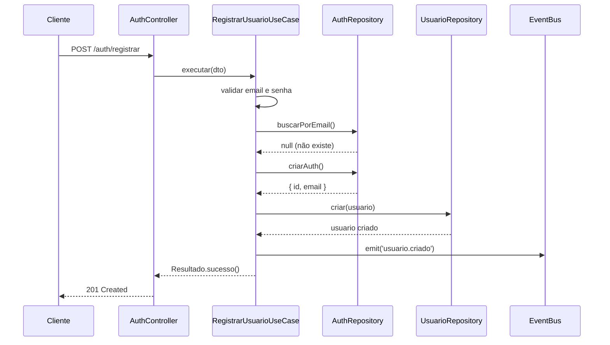
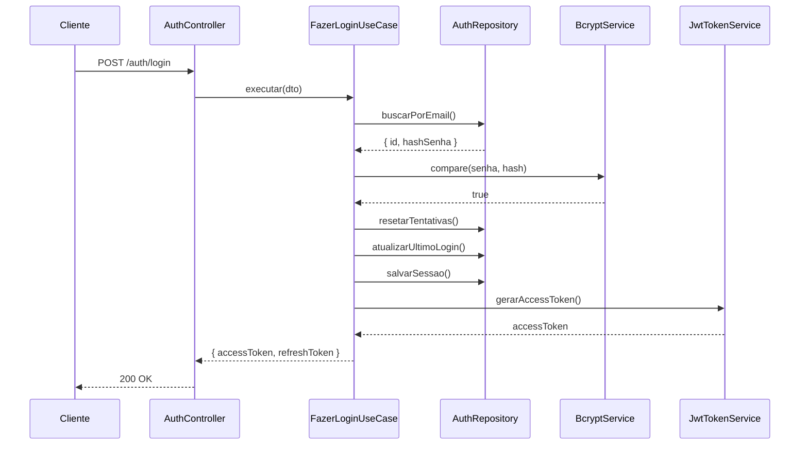
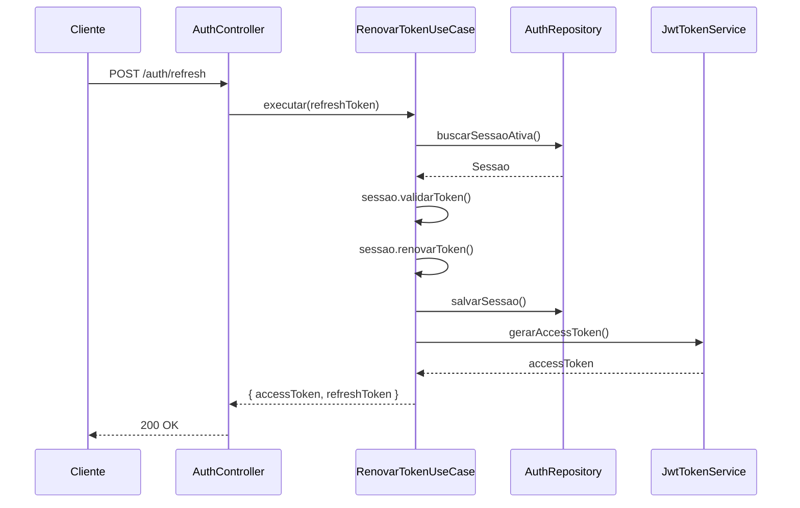

# **Implementação Auth & Usuários - DDD Architecture**

---

## 📚 Índice

- [1. Visão Geral da Arquitetura](#1-visão-geral-da-arquitetura)
- [2. Estrutura de Diretórios](#2-estrutura-de-diretórios)
- [3. Módulo de Autenticação (Auth)](#3-módulo-de-autenticação-auth)
  - [3.1 Domain Layer](#31-domain-layer---auth)
  - [3.2 Application Layer](#32-application-layer---auth)
  - [3.3 Infrastructure Layer](#33-infrastructure-layer---auth)
  - [3.4 Presentation Layer](#34-presentation-layer---auth)
- [4. Módulo de Usuários](#4-módulo-de-usuários)
  - [4.1 Domain Layer](#41-domain-layer---usuários)
  - [4.2 Application Layer](#42-application-layer---usuários)
  - [4.3 Infrastructure Layer](#43-infrastructure-layer---usuários)
  - [4.4 Presentation Layer](#44-presentation-layer---usuários)
- [5. Fluxos de Autenticação](#5-fluxos-de-autenticação)
- [6. Segurança](#6-segurança)
- [7. Migrations](#7-migrations)
- [8. Testes](#8-testes)

---

## 1. Visão Geral da Arquitetura

### **Princípios DDD Aplicados**

```
┌─────────────────────────────────────────────────────────────┐
│                      PRESENTATION LAYER                      │
│              (Controllers, DTOs, Guards)                     │
└──────────────────────────┬──────────────────────────────────┘
                           │
┌──────────────────────────▼──────────────────────────────────┐
│                     APPLICATION LAYER                        │
│         (Use Cases, Commands, Queries, Services)             │
└──────────────────────────┬──────────────────────────────────┘
                           │
┌──────────────────────────▼──────────────────────────────────┐
│                       DOMAIN LAYER                           │
│    (Entities, Value Objects, Domain Services, Events)        │
└──────────────────────────┬──────────────────────────────────┘
                           │
┌──────────────────────────▼──────────────────────────────────┐
│                   INFRASTRUCTURE LAYER                       │
│   (Repositories, TypeORM Models, External Services)          │
└─────────────────────────────────────────────────────────────┘
```

### **Separação de Contextos**

- **Auth Module**: Gerencia autenticação, tokens, sessões
- **Usuario Module**: Gerencia perfil, verificações, dados do usuário
- **Comunicação**: Via eventos de domínio e injeção de dependências

---

## 2. Estrutura de Diretórios

```
src/modules/
├── auth/
│   ├── domain/
│   │   ├── entities/
│   │   │   └── sessao.entity.ts
│   │   ├── value-objects/
│   │   │   ├── senha.vo.ts
│   │   │   ├── email.vo.ts
│   │   │   └── token-refresh.vo.ts
│   │   ├── events/
│   │   │   ├── usuario-logou.event.ts
│   │   │   ├── usuario-logout.event.ts
│   │   │   ├── senha-alterada.event.ts
│   │   │   └── tentativa-falha-login.event.ts
│   │   ├── repositories/
│   │   │   └── auth.repository.interface.ts
│   │   └── services/
│   │       └── token.service.interface.ts
│   ├── application/
│   │   ├── use-cases/
│   │   │   ├── registrar-usuario.usecase.ts
│   │   │   ├── fazer-login.usecase.ts
│   │   │   ├── renovar-token.usecase.ts
│   │   │   ├── fazer-logout.usecase.ts
│   │   │   ├── alterar-senha.usecase.ts
│   │   │   ├── resetar-senha.usecase.ts
│   │   │   ├── solicitar-reset-senha.usecase.ts
│   │   │   └── verificar-email.usecase.ts
│   │   ├── dtos/
│   │   │   ├── registrar-usuario.dto.ts
│   │   │   ├── fazer-login.dto.ts
│   │   │   ├── alterar-senha.dto.ts
│   │   │   └── resetar-senha.dto.ts
│   │   └── services/
│   │       └── jwt.service.ts
│   ├── infra/
│   │   ├── models/
│   │   │   ├── usuario-auth.model.ts (já existe)
│   │   │   ├── sessao.model.ts
│   │   │   └── token-refresh.model.ts
│   │   ├── repositories/
│   │   │   └── auth.repository.ts
│   │   └── services/
│   │       ├── bcrypt.service.ts
│   │       ├── jwt-token.service.ts
│   │       └── email.service.ts
│   ├── presentation/
│   │   ├── auth.controller.ts
│   │   ├── guards/
│   │   │   ├── jwt-auth.guard.ts
│   │   │   └── local-auth.guard.ts
│   │   └── strategies/
│   │       ├── jwt.strategy.ts
│   │       └── local.strategy.ts
│   └── auth.module.ts
│
├── usuario/
│   ├── domain/
│   │   ├── entities/
│   │   │   ├── usuario.entity.ts
│   │   │   └── comprovante-residencia.entity.ts
│   │   ├── value-objects/
│   │   │   ├── cpf.vo.ts
│   │   │   ├── telefone.vo.ts
│   │   │   ├── endereco.vo.ts (já existe)
│   │   │   └── verificacao-status.vo.ts
│   │   ├── events/
│   │   │   ├── usuario-criado.event.ts
│   │   │   ├── usuario-atualizado.event.ts
│   │   │   ├── telefone-verificado.event.ts
│   │   │   ├── email-verificado.event.ts
│   │   │   └── comprovante-enviado.event.ts
│   │   ├── repositories/
│   │   │   └── usuario.repository.interface.ts
│   │   └── services/
│   │       └── verificacao.service.interface.ts
│   ├── application/
│   │   ├── use-cases/
│   │   │   ├── criar-usuario.usecase.ts
│   │   │   ├── atualizar-perfil.usecase.ts
│   │   │   ├── buscar-usuario.usecase.ts
│   │   │   ├── enviar-codigo-sms.usecase.ts
│   │   │   ├── verificar-telefone.usecase.ts
│   │   │   ├── verificar-email.usecase.ts
│   │   │   ├── enviar-comprovante-residencia.usecase.ts
│   │   │   └── moderar-comprovante.usecase.ts
│   │   ├── dtos/
│   │   │   ├── criar-usuario.dto.ts
│   │   │   ├── atualizar-perfil.dto.ts
│   │   │   ├── verificar-telefone.dto.ts
│   │   │   └── enviar-comprovante.dto.ts
│   │   ├── queries/
│   │   │   ├── buscar-usuario-por-id.query.ts
│   │   │   ├── buscar-usuario-por-cpf.query.ts
│   │   │   └── listar-comprovanentes-pendentes.query.ts
│   │   └── services/
│   │       ├── sms.service.ts
│   │       └── storage.service.ts
│   ├── infra/
│   │   ├── models/
│   │   │   ├── usuario.model.ts (já existe)
│   │   │   ├── comprovante-residencia.model.ts (já existe)
│   │   │   ├── verificacao-telefone.model.ts
│   │   │   └── verificacao-email.model.ts
│   │   ├── repositories/
│   │   │   └── usuario.repository.ts
│   │   └── services/
│   │       ├── twilio-sms.service.ts
│   │       └── firebase-storage.service.ts
│   ├── presentation/
│   │   ├── usuario.controller.ts
│   │   └── moderacao.controller.ts
│   └── usuario.module.ts
│
└── shared/
    ├── resultado.ts (já existe)
    ├── base-entity.ts
    ├── domain-event.ts
    └── event-bus.service.ts
```

---

## 3. Módulo de Autenticação (Auth)

### 3.1 Domain Layer - Auth

#### **3.1.1 Value Objects**

**`domain/value-objects/senha.vo.ts`**

```typescript
import { Resultado } from 'src/shared/resultado';

export class Senha {
  private readonly valor: string;

  private constructor(senha: string) {
    this.valor = senha;
  }

  public static criar(senhaPlainText: string): Resultado<Senha, Error> {
    // Validações
    if (!senhaPlainText || senhaPlainText.length < 8) {
      return Resultado.falha(
        new Error('Senha deve ter no mínimo 8 caracteres'),
      );
    }

    // Regex: pelo menos 1 maiúscula, 1 minúscula, 1 número, 1 especial
    const regex =
      /^(?=.*[a-z])(?=.*[A-Z])(?=.*\d)(?=.*[@$!%*?&#])[A-Za-z\d@$!%*?&#]{8,}$/;
    if (!regex.test(senhaPlainText)) {
      return Resultado.falha(
        new Error(
          'Senha deve conter maiúscula, minúscula, número e caractere especial',
        ),
      );
    }

    return Resultado.sucesso(new Senha(senhaPlainText));
  }

  public static criarHash(hash: string): Senha {
    return new Senha(hash);
  }

  get valor(): string {
    return this.valor;
  }

  public equals(outra: Senha): boolean {
    return this.valor === outra.valor;
  }
}
```

**`domain/value-objects/email.vo.ts`**

```typescript
import { Resultado } from 'src/shared/resultado';

export class Email {
  private readonly _valor: string;

  private constructor(email: string) {
    this._valor = email.toLowerCase().trim();
  }

  public static criar(email: string): Resultado<Email, Error> {
    if (!email || email.trim().length === 0) {
      return Resultado.falha(new Error('Email é obrigatório'));
    }

    const emailRegex = /^[^\s@]+@[^\s@]+\.[^\s@]+$/;
    if (!emailRegex.test(email)) {
      return Resultado.falha(new Error('Email inválido'));
    }

    return Resultado.sucesso(new Email(email));
  }

  get valor(): string {
    return this._valor;
  }

  public equals(outro: Email): boolean {
    return this._valor === outro._valor;
  }
}
```

**`domain/value-objects/token-refresh.vo.ts`**

```typescript
import { v4 as uuidv4 } from 'uuid';

export class TokenRefresh {
  private readonly _token: string;
  private readonly _expiresAt: Date;

  private constructor(token: string, expiresAt: Date) {
    this._token = token;
    this._expiresAt = expiresAt;
  }

  public static criar(diasValidade: number = 7): TokenRefresh {
    const token = uuidv4();
    const expiresAt = new Date();
    expiresAt.setDate(expiresAt.getDate() + diasValidade);

    return new TokenRefresh(token, expiresAt);
  }

  public static recriar(token: string, expiresAt: Date): TokenRefresh {
    return new TokenRefresh(token, expiresAt);
  }

  get token(): string {
    return this._token;
  }

  get expiresAt(): Date {
    return this._expiresAt;
  }

  public estaExpirado(): boolean {
    return new Date() > this._expiresAt;
  }
}
```

#### **3.1.2 Entities**

**`domain/entities/sessao.entity.ts`**

```typescript
import { TokenRefresh } from '../value-objects/token-refresh.vo';

export interface SessaoProps {
  usuarioId: string;
  refreshToken: TokenRefresh;
  ipAddress?: string;
  userAgent?: string;
  ativa: boolean;
  criadoEm: Date;
  atualizadoEm?: Date;
}

export class Sessao {
  private props: SessaoProps;
  private _id: string;

  private constructor(id: string, props: SessaoProps) {
    this._id = id;
    this.props = props;
  }

  public static criar(
    id: string,
    usuarioId: string,
    ipAddress?: string,
    userAgent?: string,
  ): Sessao {
    const props: SessaoProps = {
      usuarioId,
      refreshToken: TokenRefresh.criar(),
      ipAddress,
      userAgent,
      ativa: true,
      criadoEm: new Date(),
    };

    return new Sessao(id, props);
  }

  public static recriar(id: string, props: SessaoProps): Sessao {
    return new Sessao(id, props);
  }

  get id(): string {
    return this._id;
  }

  get usuarioId(): string {
    return this.props.usuarioId;
  }

  get refreshToken(): TokenRefresh {
    return this.props.refreshToken;
  }

  get ativa(): boolean {
    return this.props.ativa;
  }

  get criadoEm(): Date {
    return this.props.criadoEm;
  }

  public renovarToken(): void {
    this.props.refreshToken = TokenRefresh.criar();
    this.props.atualizadoEm = new Date();
  }

  public desativar(): void {
    this.props.ativa = false;
    this.props.atualizadoEm = new Date();
  }

  public validarToken(): boolean {
    return this.props.ativa && !this.props.refreshToken.estaExpirado();
  }
}
```

#### **3.1.3 Domain Events**

**`domain/events/usuario-logou.event.ts`**

```typescript
export class UsuarioLogouEvent {
  constructor(
    public readonly usuarioId: string,
    public readonly email: string,
    public readonly ipAddress?: string,
    public readonly timestamp: Date = new Date(),
  ) {}
}
```

**`domain/events/tentativa-falha-login.event.ts`**

```typescript
export class TentativaFalhaLoginEvent {
  constructor(
    public readonly email: string,
    public readonly ipAddress?: string,
    public readonly tentativas: number,
    public readonly timestamp: Date = new Date(),
  ) {}
}
```

#### **3.1.4 Repository Interface**

**`domain/repositories/auth.repository.interface.ts`**

```typescript
import { Sessao } from '../entities/sessao.entity';
import { Email } from '../value-objects/email.vo';

export interface IAuthRepository {
  buscarPorEmail(email: Email): Promise<{
    id: string;
    email: string;
    hashSenha: string;
    tentativasFalhas: number;
    bloqueadoAte?: Date;
  } | null>;

  criarAuth(dados: {
    email: string;
    hashSenha: string;
  }): Promise<{ id: string; email: string }>;

  atualizarUltimoLogin(authId: string): Promise<void>;
  incrementarTentativasFalhas(authId: string): Promise<number>;
  resetarTentativasFalhas(authId: string): Promise<void>;
  bloquearConta(authId: string, ate: Date): Promise<void>;
  atualizarSenha(authId: string, novoHash: string): Promise<void>;

  // Sessões
  salvarSessao(sessao: Sessao): Promise<void>;
  buscarSessaoAtiva(
    usuarioId: string,
    refreshToken: string,
  ): Promise<Sessao | null>;
  desativarSessao(sessaoId: string): Promise<void>;
  desativarTodasSessoes(usuarioId: string): Promise<void>;
}
```

### 3.2 Application Layer - Auth

#### **3.2.1 DTOs**

**`application/dtos/registrar-usuario.dto.ts`**

```typescript
import {
  IsEmail,
  IsNotEmpty,
  IsString,
  MinLength,
  Matches,
} from 'class-validator';

export class RegistrarUsuarioDto {
  @IsString()
  @IsNotEmpty({ message: 'Nome é obrigatório' })
  nome: string;

  @IsEmail({}, { message: 'Email inválido' })
  @IsNotEmpty({ message: 'Email é obrigatório' })
  email: string;

  @IsString()
  @MinLength(8, { message: 'Senha deve ter no mínimo 8 caracteres' })
  @Matches(
    /^(?=.*[a-z])(?=.*[A-Z])(?=.*\d)(?=.*[@$!%*?&#])[A-Za-z\d@$!%*?&#]{8,}$/,
    {
      message:
        'Senha deve conter maiúscula, minúscula, número e caractere especial',
    },
  )
  senha: string;

  @IsString()
  @IsNotEmpty({ message: 'CPF é obrigatório' })
  @Matches(/^\d{11}$/, { message: 'CPF deve conter 11 dígitos' })
  cpf: string;

  @IsString()
  @IsNotEmpty({ message: 'Telefone é obrigatório' })
  @Matches(/^\d{10,11}$/, { message: 'Telefone inválido' })
  telefone: string;
}
```

**`application/dtos/fazer-login.dto.ts`**

```typescript
import { IsEmail, IsNotEmpty, IsString } from 'class-validator';

export class FazerLoginDto {
  @IsEmail({}, { message: 'Email inválido' })
  @IsNotEmpty({ message: 'Email é obrigatório' })
  email: string;

  @IsString()
  @IsNotEmpty({ message: 'Senha é obrigatória' })
  senha: string;
}
```

#### **3.2.2 Use Cases**

**`application/use-cases/registrar-usuario.usecase.ts`**

```typescript
import { Injectable, ConflictException } from '@nestjs/common';
import { EventEmitter2 } from '@nestjs/event-emitter';
import { IAuthRepository } from '../../domain/repositories/auth.repository.interface';
import { IUsuarioRepository } from '../../../usuario/domain/repositories/usuario.repository.interface';
import { Email } from '../../domain/value-objects/email.vo';
import { Senha } from '../../domain/value-objects/senha.vo';
import { RegistrarUsuarioDto } from '../dtos/registrar-usuario.dto';
import { BcryptService } from '../../infra/services/bcrypt.service';
import { Resultado } from 'src/shared/resultado';
import { UsuarioCriadoEvent } from '../../../usuario/domain/events/usuario-criado.event';

@Injectable()
export class RegistrarUsuarioUseCase {
  constructor(
    private readonly authRepository: IAuthRepository,
    private readonly usuarioRepository: IUsuarioRepository,
    private readonly bcryptService: BcryptService,
    private readonly eventEmitter: EventEmitter2,
  ) {}

  async executar(
    dto: RegistrarUsuarioDto,
  ): Promise<Resultado<{ usuarioId: string; email: string }, Error>> {
    // 1. Validar email
    const emailResult = Email.criar(dto.email);
    if (emailResult.ehFalha()) {
      return Resultado.falha(emailResult.erro);
    }
    const email = emailResult.valor;

    // 2. Verificar se email já existe
    const emailExiste = await this.authRepository.buscarPorEmail(email);
    if (emailExiste) {
      throw new ConflictException('Email já cadastrado');
    }

    // 3. Verificar se CPF já existe
    const cpfExiste = await this.usuarioRepository.buscarPorCpf(dto.cpf);
    if (cpfExiste) {
      throw new ConflictException('CPF já cadastrado');
    }

    // 4. Validar senha
    const senhaResult = Senha.criar(dto.senha);
    if (senhaResult.ehFalha()) {
      return Resultado.falha(senhaResult.erro);
    }

    // 5. Hash da senha
    const hashSenha = await this.bcryptService.hash(dto.senha);

    // 6. Criar registro de autenticação
    const auth = await this.authRepository.criarAuth({
      email: email.valor,
      hashSenha,
    });

    // 7. Criar usuário
    const usuario = await this.usuarioRepository.criar({
      authId: auth.id,
      nome: dto.nome,
      email: email.valor,
      cpf: dto.cpf,
      telefone: dto.telefone,
    });

    // 8. Emitir evento
    this.eventEmitter.emit(
      'usuario.criado',
      new UsuarioCriadoEvent(usuario.id, email.valor, dto.nome),
    );

    return Resultado.sucesso({
      usuarioId: usuario.id,
      email: email.valor,
    });
  }
}
```

**`application/use-cases/fazer-login.usecase.ts`**

```typescript
import { Injectable, UnauthorizedException } from '@nestjs/common';
import { EventEmitter2 } from '@nestjs/event-emitter';
import { IAuthRepository } from '../../domain/repositories/auth.repository.interface';
import { Email } from '../../domain/value-objects/email.vo';
import { FazerLoginDto } from '../dtos/fazer-login.dto';
import { BcryptService } from '../../infra/services/bcrypt.service';
import { JwtTokenService } from '../../infra/services/jwt-token.service';
import { Sessao } from '../../domain/entities/sessao.entity';
import { UsuarioLogouEvent } from '../../domain/events/usuario-logou.event';
import { TentativaFalhaLoginEvent } from '../../domain/events/tentativa-falha-login.event';
import { v4 as uuidv4 } from 'uuid';

@Injectable()
export class FazerLoginUseCase {
  constructor(
    private readonly authRepository: IAuthRepository,
    private readonly bcryptService: BcryptService,
    private readonly jwtTokenService: JwtTokenService,
    private readonly eventEmitter: EventEmitter2,
  ) {}

  async executar(
    dto: FazerLoginDto,
    ipAddress?: string,
    userAgent?: string,
  ): Promise<{
    accessToken: string;
    refreshToken: string;
    expiresIn: number;
  }> {
    // 1. Validar email
    const emailResult = Email.criar(dto.email);
    if (emailResult.ehFalha()) {
      throw new UnauthorizedException('Credenciais inválidas');
    }
    const email = emailResult.valor;

    // 2. Buscar usuário
    const auth = await this.authRepository.buscarPorEmail(email);
    if (!auth) {
      throw new UnauthorizedException('Credenciais inválidas');
    }

    // 3. Verificar bloqueio
    if (auth.bloqueadoAte && auth.bloqueadoAte > new Date()) {
      const minutosRestantes = Math.ceil(
        (auth.bloqueadoAte.getTime() - Date.now()) / 60000,
      );
      throw new UnauthorizedException(
        `Conta bloqueada. Tente novamente em ${minutosRestantes} minutos.`,
      );
    }

    // 4. Verificar senha
    const senhaCorreta = await this.bcryptService.compare(
      dto.senha,
      auth.hashSenha,
    );

    if (!senhaCorreta) {
      // Incrementar tentativas
      const tentativas = await this.authRepository.incrementarTentativasFalhas(
        auth.id,
      );

      // Emitir evento
      this.eventEmitter.emit(
        'auth.tentativa-falha',
        new TentativaFalhaLoginEvent(email.valor, ipAddress, tentativas),
      );

      // Bloquear após 5 tentativas
      if (tentativas >= 5) {
        const bloqueadoAte = new Date();
        bloqueadoAte.setMinutes(bloqueadoAte.getMinutes() + 30);
        await this.authRepository.bloquearConta(auth.id, bloqueadoAte);
        throw new UnauthorizedException(
          'Conta bloqueada por 30 minutos após 5 tentativas falhas',
        );
      }

      throw new UnauthorizedException('Credenciais inválidas');
    }

    // 5. Resetar tentativas e atualizar último login
    await this.authRepository.resetarTentativasFalhas(auth.id);
    await this.authRepository.atualizarUltimoLogin(auth.id);

    // 6. Criar sessão
    const sessao = Sessao.criar(uuidv4(), auth.id, ipAddress, userAgent);
    await this.authRepository.salvarSessao(sessao);

    // 7. Gerar tokens
    const accessToken = this.jwtTokenService.gerarAccessToken({
      sub: auth.id,
      email: email.valor,
    });

    // 8. Emitir evento
    this.eventEmitter.emit(
      'auth.usuario-logou',
      new UsuarioLogouEvent(auth.id, email.valor, ipAddress),
    );

    return {
      accessToken,
      refreshToken: sessao.refreshToken.token,
      expiresIn: 3600, // 1 hora
    };
  }
}
```

**`application/use-cases/renovar-token.usecase.ts`**

```typescript
import { Injectable, UnauthorizedException } from '@nestjs/common';
import { IAuthRepository } from '../../domain/repositories/auth.repository.interface';
import { JwtTokenService } from '../../infra/services/jwt-token.service';

@Injectable()
export class RenovarTokenUseCase {
  constructor(
    private readonly authRepository: IAuthRepository,
    private readonly jwtTokenService: JwtTokenService,
  ) {}

  async executar(refreshToken: string): Promise<{
    accessToken: string;
    refreshToken: string;
    expiresIn: number;
  }> {
    // 1. Buscar sessão ativa
    const sessao = await this.authRepository.buscarSessaoAtiva(
      null,
      refreshToken,
    );

    if (!sessao || !sessao.validarToken()) {
      throw new UnauthorizedException('Refresh token inválido ou expirado');
    }

    // 2. Renovar refresh token
    sessao.renovarToken();
    await this.authRepository.salvarSessao(sessao);

    // 3. Gerar novo access token
    const accessToken = this.jwtTokenService.gerarAccessToken({
      sub: sessao.usuarioId,
    });

    return {
      accessToken,
      refreshToken: sessao.refreshToken.token,
      expiresIn: 3600,
    };
  }
}
```

### 3.3 Infrastructure Layer - Auth

#### **3.3.1 TypeORM Models**

**`infra/models/sessao.model.ts`**

```typescript
import {
  Column,
  Entity,
  PrimaryColumn,
  CreateDateColumn,
  UpdateDateColumn,
  Index,
} from 'typeorm';

@Entity('sessao')
@Index(['usuarioId', 'ativa'])
@Index(['refreshToken'])
export class SessaoModel {
  @PrimaryColumn('uuid')
  id: string;

  @Column({ name: 'usuario_id', type: 'uuid' })
  usuarioId: string;

  @Column({ name: 'refresh_token', type: 'varchar', length: 255 })
  refreshToken: string;

  @Column({ name: 'expires_at', type: 'timestamp' })
  expiresAt: Date;

  @Column({ name: 'ip_address', type: 'varchar', length: 45, nullable: true })
  ipAddress?: string;

  @Column({ name: 'user_agent', type: 'text', nullable: true })
  userAgent?: string;

  @Column({ type: 'boolean', default: true })
  ativa: boolean;

  @CreateDateColumn({ name: 'created_at' })
  createdAt: Date;

  @UpdateDateColumn({ name: 'updated_at' })
  updatedAt: Date;
}
```

#### **3.3.2 Repository Implementation**

**`infra/repositories/auth.repository.ts`**

```typescript
import { Injectable } from '@nestjs/common';
import { InjectRepository } from '@nestjs/typeorm';
import { Repository } from 'typeorm';
import { IAuthRepository } from '../../domain/repositories/auth.repository.interface';
import { UsuarioAuthModel } from '../models/usuario-auth.model';
import { SessaoModel } from '../models/sessao.model';
import { Email } from '../../domain/value-objects/email.vo';
import { Sessao } from '../../domain/entities/sessao.entity';
import { TokenRefresh } from '../../domain/value-objects/token-refresh.vo';

@Injectable()
export class AuthRepository implements IAuthRepository {
  constructor(
    @InjectRepository(UsuarioAuthModel)
    private readonly authRepo: Repository<UsuarioAuthModel>,
    @InjectRepository(SessaoModel)
    private readonly sessaoRepo: Repository<SessaoModel>,
  ) {}

  async buscarPorEmail(email: Email): Promise<{
    id: string;
    email: string;
    hashSenha: string;
    tentativasFalhas: number;
    bloqueadoAte?: Date;
  } | null> {
    const auth = await this.authRepo
      .createQueryBuilder('auth')
      .addSelect('auth.hashSenha')
      .where('auth.email = :email', { email: email.valor })
      .getOne();

    if (!auth) return null;

    return {
      id: auth.id,
      email: auth.email,
      hashSenha: auth.hashSenha,
      tentativasFalhas: auth.tentativasFalhas,
      bloqueadoAte: auth.bloqueadoAte,
    };
  }

  async criarAuth(dados: {
    email: string;
    hashSenha: string;
  }): Promise<{ id: string; email: string }> {
    const auth = this.authRepo.create({
      email: dados.email,
      hashSenha: dados.hashSenha,
    });

    const saved = await this.authRepo.save(auth);
    return { id: saved.id, email: saved.email };
  }

  async atualizarUltimoLogin(authId: string): Promise<void> {
    await this.authRepo.update(authId, { dataUltimoLogin: new Date() });
  }

  async incrementarTentativasFalhas(authId: string): Promise<number> {
    await this.authRepo.increment({ id: authId }, 'tentativasFalhas', 1);
    const auth = await this.authRepo.findOne({ where: { id: authId } });
    return auth.tentativasFalhas;
  }

  async resetarTentativasFalhas(authId: string): Promise<void> {
    await this.authRepo.update(authId, {
      tentativasFalhas: 0,
      bloqueadoAte: null,
    });
  }

  async bloquearConta(authId: string, ate: Date): Promise<void> {
    await this.authRepo.update(authId, { bloqueadoAte: ate });
  }

  async atualizarSenha(authId: string, novoHash: string): Promise<void> {
    await this.authRepo.update(authId, { hashSenha: novoHash });
  }

  // Sessões
  async salvarSessao(sessao: Sessao): Promise<void> {
    const model = this.sessaoRepo.create({
      id: sessao.id,
      usuarioId: sessao.usuarioId,
      refreshToken: sessao.refreshToken.token,
      expiresAt: sessao.refreshToken.expiresAt,
      ativa: sessao.ativa,
    });

    await this.sessaoRepo.save(model);
  }

  async buscarSessaoAtiva(
    usuarioId: string,
    refreshToken: string,
  ): Promise<Sessao | null> {
    const model = await this.sessaoRepo.findOne({
      where: {
        refreshToken,
        ativa: true,
      },
    });

    if (!model) return null;

    return Sessao.recriar(model.id, {
      usuarioId: model.usuarioId,
      refreshToken: TokenRefresh.recriar(model.refreshToken, model.expiresAt),
      ipAddress: model.ipAddress,
      userAgent: model.userAgent,
      ativa: model.ativa,
      criadoEm: model.createdAt,
      atualizadoEm: model.updatedAt,
    });
  }

  async desativarSessao(sessaoId: string): Promise<void> {
    await this.sessaoRepo.update(sessaoId, { ativa: false });
  }

  async desativarTodasSessoes(usuarioId: string): Promise<void> {
    await this.sessaoRepo.update({ usuarioId }, { ativa: false });
  }
}
```

#### **3.3.3 Services**

**`infra/services/bcrypt.service.ts`**

```typescript
import { Injectable } from '@nestjs/common';
import * as bcrypt from 'bcrypt';

@Injectable()
export class BcryptService {
  private readonly saltRounds = 10;

  async hash(senha: string): Promise<string> {
    return bcrypt.hash(senha, this.saltRounds);
  }

  async compare(senha: string, hash: string): Promise<boolean> {
    return bcrypt.compare(senha, hash);
  }
}
```

**`infra/services/jwt-token.service.ts`**

```typescript
import { Injectable } from '@nestjs/common';
import { JwtService } from '@nestjs/jwt';
import { ConfigService } from '@nestjs/config';

@Injectable()
export class JwtTokenService {
  constructor(
    private readonly jwtService: JwtService,
    private readonly configService: ConfigService,
  ) {}

  gerarAccessToken(payload: { sub: string; email?: string }): string {
    return this.jwtService.sign(payload, {
      secret: this.configService.get('JWT_SECRET'),
      expiresIn: '1h',
    });
  }

  verificarToken(token: string): any {
    try {
      return this.jwtService.verify(token, {
        secret: this.configService.get('JWT_SECRET'),
      });
    } catch (error) {
      return null;
    }
  }
}
```

### 3.4 Presentation Layer - Auth

**`presentation/auth.controller.ts`**

```typescript
import {
  Controller,
  Post,
  Body,
  HttpCode,
  HttpStatus,
  Req,
  UseGuards,
  Get,
} from '@nestjs/common';
import { Request } from 'express';
import { RegistrarUsuarioUseCase } from '../application/use-cases/registrar-usuario.usecase';
import { FazerLoginUseCase } from '../application/use-cases/fazer-login.usecase';
import { RenovarTokenUseCase } from '../application/use-cases/renovar-token.usecase';
import { FazerLogoutUseCase } from '../application/use-cases/fazer-logout.usecase';
import { RegistrarUsuarioDto } from '../application/dtos/registrar-usuario.dto';
import { FazerLoginDto } from '../application/dtos/fazer-login.dto';
import { JwtAuthGuard } from './guards/jwt-auth.guard';

@Controller('auth')
export class AuthController {
  constructor(
    private readonly registrarUsuario: RegistrarUsuarioUseCase,
    private readonly fazerLogin: FazerLoginUseCase,
    private readonly renovarToken: RenovarTokenUseCase,
    private readonly fazerLogout: FazerLogoutUseCase,
  ) {}

  @Post('registrar')
  @HttpCode(HttpStatus.CREATED)
  async registrar(@Body() dto: RegistrarUsuarioDto) {
    const result = await this.registrarUsuario.executar(dto);

    if (result.ehFalha()) {
      throw result.erro;
    }

    return {
      message: 'Usuário criado com sucesso',
      data: result.valor,
    };
  }

  @Post('login')
  @HttpCode(HttpStatus.OK)
  async login(@Body() dto: FazerLoginDto, @Req() req: Request) {
    const ipAddress = req.ip;
    const userAgent = req.headers['user-agent'];

    const result = await this.fazerLogin.executar(dto, ipAddress, userAgent);

    return {
      message: 'Login realizado com sucesso',
      data: result,
    };
  }

  @Post('refresh')
  @HttpCode(HttpStatus.OK)
  async refresh(@Body('refreshToken') refreshToken: string) {
    const result = await this.renovarToken.executar(refreshToken);

    return {
      message: 'Token renovado com sucesso',
      data: result,
    };
  }

  @Post('logout')
  @UseGuards(JwtAuthGuard)
  @HttpCode(HttpStatus.OK)
  async logout(@Req() req: any) {
    await this.fazerLogout.executar(req.user.sub);

    return {
      message: 'Logout realizado com sucesso',
    };
  }

  @Get('me')
  @UseGuards(JwtAuthGuard)
  async me(@Req() req: any) {
    return {
      userId: req.user.sub,
      email: req.user.email,
    };
  }
}
```

**`presentation/guards/jwt-auth.guard.ts`**

```typescript
import { Injectable, ExecutionContext } from '@nestjs/common';
import { AuthGuard } from '@nestjs/passport';

@Injectable()
export class JwtAuthGuard extends AuthGuard('jwt') {
  canActivate(context: ExecutionContext) {
    return super.canActivate(context);
  }
}
```

**`presentation/strategies/jwt.strategy.ts`**

```typescript
import { Injectable, UnauthorizedException } from '@nestjs/common';
import { PassportStrategy } from '@nestjs/passport';
import { ExtractJwt, Strategy } from 'passport-jwt';
import { ConfigService } from '@nestjs/config';

@Injectable()
export class JwtStrategy extends PassportStrategy(Strategy) {
  constructor(private configService: ConfigService) {
    super({
      jwtFromRequest: ExtractJwt.fromAuthHeaderAsBearerToken(),
      ignoreExpiration: false,
      secretOrKey: configService.get('JWT_SECRET'),
    });
  }

  async validate(payload: any) {
    if (!payload.sub) {
      throw new UnauthorizedException();
    }

    return {
      sub: payload.sub,
      email: payload.email,
    };
  }
}
```

---

## 4. Módulo de Usuários

_(Continua na próxima seção com estrutura similar...)_

---

## 5. Fluxos de Autenticação

### **5.1 Fluxo de Registro**



### **5.2 Fluxo de Login**



### **5.3 Fluxo de Renovação de Token**



---

## 6. Segurança

### **6.1 Estratégias de Segurança**

| Aspecto                | Implementação    | Descrição                                    |
| ---------------------- | ---------------- | -------------------------------------------- |
| **Hash de Senha**      | Bcrypt           | 10 rounds de salt                            |
| **Tokens JWT**         | Access Token     | Expira em 1 hora                             |
| **Refresh Token**      | UUID v4          | Expira em 7 dias                             |
| **Bloqueio de Conta**  | Automático       | Após 5 tentativas falhas, bloqueio de 30 min |
| **Rate Limiting**      | Throttler        | 10 requisições/minuto por IP                 |
| **CORS**               | Configurado      | Apenas origens autorizadas                   |
| **Helmet**             | Headers Security | XSS, CSP, HSTS                               |
| **Session Management** | Database         | Sessões ativas rastreadas                    |

### **6.2 Variáveis de Ambiente**

```env
# JWT
JWT_SECRET=seu_secret_super_seguro_aqui_min_32_caracteres
JWT_EXPIRES_IN=1h

# Refresh Token
REFRESH_TOKEN_EXPIRES_DAYS=7

# Bcrypt
BCRYPT_SALT_ROUNDS=10

# Bloqueio
MAX_LOGIN_ATTEMPTS=5
LOCKOUT_DURATION_MINUTES=30

# Rate Limiting
THROTTLE_TTL=60
THROTTLE_LIMIT=10
```

---

## 7. Migrations

### **7.1 Criar Tabela usuario_auth**

```typescript
import { MigrationInterface, QueryRunner, Table, TableIndex } from 'typeorm';

export class CreateUsuarioAuthTable1234567890000 implements MigrationInterface {
  public async up(queryRunner: QueryRunner): Promise<void> {
    await queryRunner.createTable(
      new Table({
        name: 'usuario_auth',
        columns: [
          {
            name: 'id',
            type: 'uuid',
            isPrimary: true,
            default: 'uuid_generate_v4()',
          },
          {
            name: 'email',
            type: 'varchar',
            length: '255',
            isUnique: true,
            isNullable: false,
          },
          {
            name: 'hash_senha',
            type: 'varchar',
            length: '255',
            isNullable: false,
          },
          {
            name: 'data_ultimo_login',
            type: 'timestamp',
            isNullable: true,
          },
          {
            name: 'tentativas_falhas',
            type: 'integer',
            default: 0,
          },
          {
            name: 'bloqueado_ate',
            type: 'timestamp',
            isNullable: true,
          },
          {
            name: 'created_at',
            type: 'timestamp',
            default: 'now()',
          },
        ],
      }),
      true,
    );

    await queryRunner.createIndex(
      'usuario_auth',
      new TableIndex({
        name: 'IDX_USUARIO_AUTH_EMAIL',
        columnNames: ['email'],
      }),
    );

    await queryRunner.createIndex(
      'usuario_auth',
      new TableIndex({
        name: 'IDX_USUARIO_AUTH_CREATED_AT',
        columnNames: ['created_at'],
      }),
    );
  }

  public async down(queryRunner: QueryRunner): Promise<void> {
    await queryRunner.dropTable('usuario_auth');
  }
}
```

### **7.2 Criar Tabela sessao**

```typescript
import {
  MigrationInterface,
  QueryRunner,
  Table,
  TableIndex,
  TableForeignKey,
} from 'typeorm';

export class CreateSessaoTable1234567890001 implements MigrationInterface {
  public async up(queryRunner: QueryRunner): Promise<void> {
    await queryRunner.createTable(
      new Table({
        name: 'sessao',
        columns: [
          {
            name: 'id',
            type: 'uuid',
            isPrimary: true,
          },
          {
            name: 'usuario_id',
            type: 'uuid',
            isNullable: false,
          },
          {
            name: 'refresh_token',
            type: 'varchar',
            length: '255',
            isNullable: false,
          },
          {
            name: 'expires_at',
            type: 'timestamp',
            isNullable: false,
          },
          {
            name: 'ip_address',
            type: 'varchar',
            length: '45',
            isNullable: true,
          },
          {
            name: 'user_agent',
            type: 'text',
            isNullable: true,
          },
          {
            name: 'ativa',
            type: 'boolean',
            default: true,
          },
          {
            name: 'created_at',
            type: 'timestamp',
            default: 'now()',
          },
          {
            name: 'updated_at',
            type: 'timestamp',
            default: 'now()',
          },
        ],
      }),
      true,
    );

    await queryRunner.createIndex(
      'sessao',
      new TableIndex({
        name: 'IDX_SESSAO_USUARIO_ATIVA',
        columnNames: ['usuario_id', 'ativa'],
      }),
    );

    await queryRunner.createIndex(
      'sessao',
      new TableIndex({
        name: 'IDX_SESSAO_REFRESH_TOKEN',
        columnNames: ['refresh_token'],
      }),
    );

    await queryRunner.createForeignKey(
      'sessao',
      new TableForeignKey({
        columnNames: ['usuario_id'],
        referencedColumnNames: ['id'],
        referencedTableName: 'usuario_auth',
        onDelete: 'CASCADE',
      }),
    );
  }

  public async down(queryRunner: QueryRunner): Promise<void> {
    await queryRunner.dropTable('sessao');
  }
}
```

---

## 8. Testes

### **8.1 Testes Unitários - Use Case**

```typescript
// registrar-usuario.usecase.spec.ts
import { Test } from '@nestjs/testing';
import { RegistrarUsuarioUseCase } from './registrar-usuario.usecase';
import { IAuthRepository } from '../../domain/repositories/auth.repository.interface';
import { IUsuarioRepository } from '../../../usuario/domain/repositories/usuario.repository.interface';
import { BcryptService } from '../../infra/services/bcrypt.service';
import { EventEmitter2 } from '@nestjs/event-emitter';
import { ConflictException } from '@nestjs/common';

describe('RegistrarUsuarioUseCase', () => {
  let useCase: RegistrarUsuarioUseCase;
  let authRepository: jest.Mocked<IAuthRepository>;
  let usuarioRepository: jest.Mocked<IUsuarioRepository>;
  let bcryptService: jest.Mocked<BcryptService>;

  beforeEach(async () => {
    const module = await Test.createTestingModule({
      providers: [
        RegistrarUsuarioUseCase,
        {
          provide: 'IAuthRepository',
          useValue: {
            buscarPorEmail: jest.fn(),
            criarAuth: jest.fn(),
          },
        },
        {
          provide: 'IUsuarioRepository',
          useValue: {
            buscarPorCpf: jest.fn(),
            criar: jest.fn(),
          },
        },
        {
          provide: BcryptService,
          useValue: {
            hash: jest.fn(),
          },
        },
        {
          provide: EventEmitter2,
          useValue: {
            emit: jest.fn(),
          },
        },
      ],
    }).compile();

    useCase = module.get(RegistrarUsuarioUseCase);
    authRepository = module.get('IAuthRepository');
    usuarioRepository = module.get('IUsuarioRepository');
    bcryptService = module.get(BcryptService);
  });

  describe('executar', () => {
    it('deve criar usuário com sucesso', async () => {
      const dto = {
        nome: 'João Silva',
        email: 'joao@example.com',
        senha: 'Senha@123',
        cpf: '12345678900',
        telefone: '11987654321',
      };

      authRepository.buscarPorEmail.mockResolvedValue(null);
      usuarioRepository.buscarPorCpf.mockResolvedValue(null);
      bcryptService.hash.mockResolvedValue('hash_senha');
      authRepository.criarAuth.mockResolvedValue({
        id: 'auth-id',
        email: dto.email,
      });
      usuarioRepository.criar.mockResolvedValue({
        id: 'user-id',
        email: dto.email,
      });

      const result = await useCase.executar(dto);

      expect(result.ehSucesso()).toBe(true);
      expect(result.valor).toEqual({
        usuarioId: 'user-id',
        email: dto.email,
      });
    });

    it('deve lançar erro se email já existe', async () => {
      const dto = {
        nome: 'João Silva',
        email: 'joao@example.com',
        senha: 'Senha@123',
        cpf: '12345678900',
        telefone: '11987654321',
      };

      authRepository.buscarPorEmail.mockResolvedValue({
        id: 'existing-id',
        email: dto.email,
        hashSenha: 'hash',
        tentativasFalhas: 0,
      });

      await expect(useCase.executar(dto)).rejects.toThrow(ConflictException);
    });

    it('deve validar formato de senha', async () => {
      const dto = {
        nome: 'João Silva',
        email: 'joao@example.com',
        senha: '123', // senha fraca
        cpf: '12345678900',
        telefone: '11987654321',
      };

      authRepository.buscarPorEmail.mockResolvedValue(null);
      usuarioRepository.buscarPorCpf.mockResolvedValue(null);

      const result = await useCase.executar(dto);

      expect(result.ehFalha()).toBe(true);
      expect(result.erro.message).toContain('Senha deve');
    });
  });
});
```

### **8.2 Testes de Integração - Controller**

```typescript
// auth.controller.e2e-spec.ts
import { Test } from '@nestjs/testing';
import { INestApplication } from '@nestjs/common';
import * as request from 'supertest';
import { AppModule } from '../../../app.module';

describe('AuthController (e2e)', () => {
  let app: INestApplication;

  beforeAll(async () => {
    const module = await Test.createTestingModule({
      imports: [AppModule],
    }).compile();

    app = module.createNestApplication();
    await app.init();
  });

  afterAll(async () => {
    await app.close();
  });

  describe('/auth/registrar (POST)', () => {
    it('deve criar usuário com sucesso', async () => {
      const dto = {
        nome: 'João Silva',
        email: `teste${Date.now()}@example.com`,
        senha: 'Senha@123',
        cpf: '12345678900',
        telefone: '11987654321',
      };

      const response = await request(app.getHttpServer())
        .post('/auth/registrar')
        .send(dto)
        .expect(201);

      expect(response.body.data).toHaveProperty('usuarioId');
      expect(response.body.data.email).toBe(dto.email);
    });

    it('deve retornar 409 se email já existe', async () => {
      const dto = {
        nome: 'João Silva',
        email: 'duplicado@example.com',
        senha: 'Senha@123',
        cpf: '12345678900',
        telefone: '11987654321',
      };

      // Criar primeiro usuário
      await request(app.getHttpServer()).post('/auth/registrar').send(dto);

      // Tentar criar duplicado
      await request(app.getHttpServer())
        .post('/auth/registrar')
        .send(dto)
        .expect(409);
    });
  });

  describe('/auth/login (POST)', () => {
    it('deve fazer login com sucesso', async () => {
      const email = `login${Date.now()}@example.com`;
      const senha = 'Senha@123';

      // Criar usuário
      await request(app.getHttpServer()).post('/auth/registrar').send({
        nome: 'João Silva',
        email,
        senha,
        cpf: '12345678900',
        telefone: '11987654321',
      });

      // Fazer login
      const response = await request(app.getHttpServer())
        .post('/auth/login')
        .send({ email, senha })
        .expect(200);

      expect(response.body.data).toHaveProperty('accessToken');
      expect(response.body.data).toHaveProperty('refreshToken');
    });

    it('deve bloquear após 5 tentativas falhas', async () => {
      const email = 'bloquear@example.com';

      // 5 tentativas falhas
      for (let i = 0; i < 5; i++) {
        await request(app.getHttpServer())
          .post('/auth/login')
          .send({ email, senha: 'SenhaErrada@123' })
          .expect(401);
      }

      // 6ª tentativa deve retornar bloqueio
      const response = await request(app.getHttpServer())
        .post('/auth/login')
        .send({ email, senha: 'SenhaErrada@123' })
        .expect(401);

      expect(response.body.message).toContain('bloqueada');
    });
  });
});
```

---

## Próximos Passos

1. **Implementar Módulo de Usuários** (seção 4)
2. **Criar verificação de telefone via SMS**
3. **Implementar upload de comprovante de residência**
4. **Criar sistema de moderação**
5. **Implementar reset de senha por email**
6. **Adicionar 2FA (opcional)**
7. **Criar dashboard de administração**

---

## Dependências Necessárias

```bash
npm install --save @nestjs/passport passport passport-local passport-jwt
npm install --save @nestjs/jwt
npm install --save bcrypt
npm install --save class-validator class-transformer
npm install --save @nestjs/event-emitter
npm install --save uuid

npm install --save-dev @types/passport-local @types/passport-jwt
npm install --save-dev @types/bcrypt
npm install --save-dev @types/uuid
```

---

**Documento criado por**: GitHub Copilot  
**Data**: Dezembro 2024  
**Versão**: 1.0
